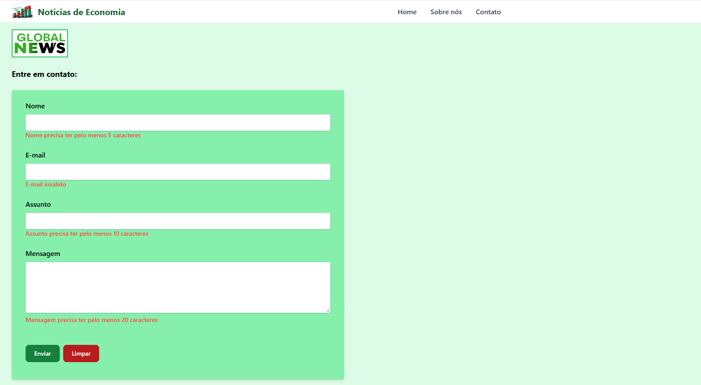

## Aplicação web de notícias de economia

Aplicação web para publicação de notícias de economia. A aplicação possui as seguintes características:
- Na página inicial são apresentados os títulos e uma breve descrição das notícias, bem como a data em que a mesma foi publicada;
- O conteúdo de cada notícia é acessado clicando-se no título da notícia. Algumas possuem possuem imagens;
- Além da página inicial, a aplicação possui as seguintes páginas: "Sobre nós", onde constam informações do grupo empresarial que é proprietário da aplicação; "Contato", que possui um formulário para envio de dúvidas, reclamações e sugestões; e "Política de privacidade" que contém a política de privacidade da aplicação.

No quesito técnico, a aplicação possui as seguintes características:
- Foi desenvolvido utilizando-se o framework Gatsby;
- A estilização dos elementos das páginas foi realizada utilizando o framework Tailwind CSS;
- Cada notícia é inserida em arquivos individuais no formato Markdown, que são posteriormente convertidos em HTML e renderizados na aplicação;
- A geração da página inicial e das páginas de cada notícia é feita filtrando os elementos dos arquivos de notícias por meio da linguagem GraphQL;
- As imagens são otimizadas pelo plugin 'gatsby-plugin-image';
- O formulário de contato tem validações em todos os campos; e
- A aplicação está em produção na plataforma Netlify e pode ser acessada pela URL: <https://noticias-de-economia.netlify.app/>

As imagens abaixo representam as telas da aplicação em funcionamento:

1. Página inicial (Home)

2. Página de uma notícia

3. Página "Sobre nós"

4. Página "Contato"

5. Página "Política de privacidade"

